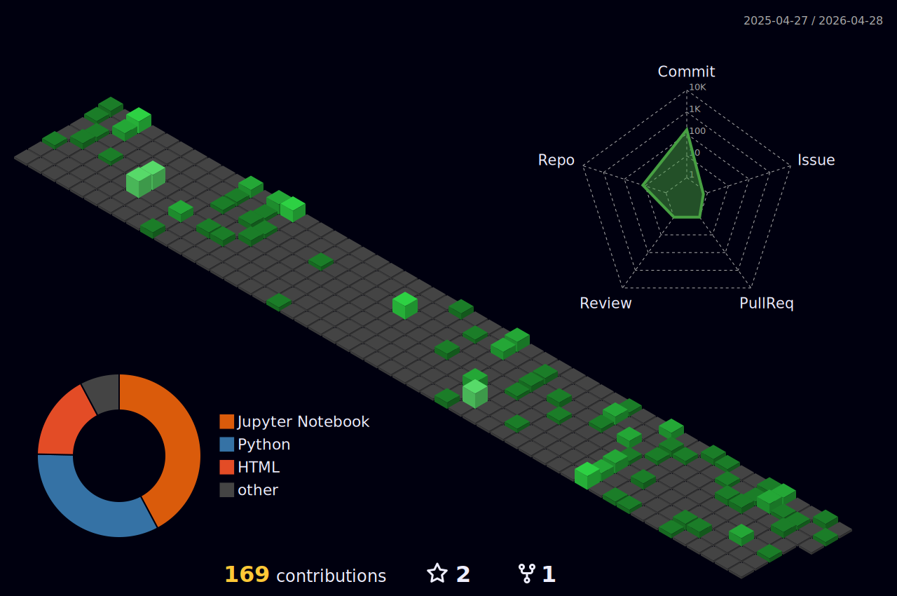

# 💫 About Me:
- I am Abhay, PhD student in the Intelligent Systems Program at Pitt, grateful to work in the Intelligent Computing for Clinical Imaging(ICCI) lab, advised by [Dr Shandong Wu](https://www.aimi.pitt.edu/people/ant-26). I do research in multimodal machine learning, representation learning, VLMs in biomedical imaging/NLP domain.
- Broadly, my interests are DL, RL, ML Systems, and Agentic AI. 
- I did my MS in Information Science: Machine Learning at the University of Arizona. During this time, I got the opportunity to work as a Graduate Research Assistant in the Deep Target NLP Research Group under the guidance of [Dr Gondy Leroy](https://eller.arizona.edu/people/gondy-leroy). 
- I also worked as an AI Engineer and built an agentic RAG application to interact with relational databases, non-relational databases, PDFs and CSVs.
- I have experience in building agentic applications using open-source models on HuggingFace as well as OpenAI APIs.
- I did my Bachelors in Electrical Engineering at IIT-Tirupati. During this time I developed interest towards DL and Computer Vision and gained deep theoretical knowledge in these subjects from a signal processing perspective.
- During bachelors, I was fortunate enough to work in the [ViSAL](https://sites.google.com/iittp.ac.in/ee-spcv-lab/people/faculty) lab under the guidance of [Dr RamaKrishna Gorthi](https://ee.iittp.ac.in/Faculty_Rkg.html). I did my thesis on efficient data augmentation method for detecting drones by integrating classical computer vision and deep learning methods.

## 🌐 Socials:
   

# 💻 Tech Stack:
              
# 📊 GitHub Stats:
 
 
 
*The daily streak is not accurate due to issues in the github log*

### ✍️ Random Dev Quote

### 🔝 Top Contributed Repo

<!--### 😂 Random Dev Meme-->
<!--img src='https://randommeme-five.vercel.app/' style="height: 400px;"/-->

## 😂 Here's some developer wisdom to brighten up your day
<!---->
<!-- Markdown -->

---

## 3D profile contributions graph

<!-- Proudly created with GPRM ( https://gprm.itsvg.in ) -->
