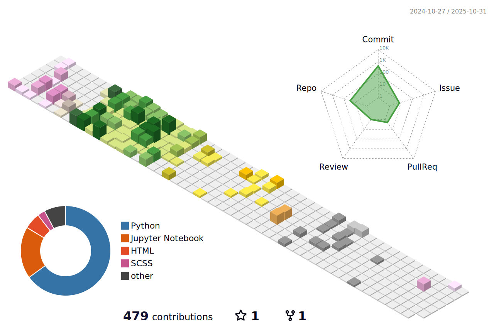

# 💫 About Me:
I am Abhay, pursuing MS in Information Science: Machine Learning at the University of Arizona. Moreover, I am working as a Graduate Research Assistant in the Deep Target NLP Research Group led by Dr Gondy Leroy. In this research assistantship I analyse biomedical text and its summaries to identify the missing information. I did my BTech in Electrical Engineering(EE) from IIT, Tirupati. During my bachelors I worked as a Computer Vision Research intern in the Visual Information and Signal Analysis Lab(ViSAL) of IIT, Tiruapti under Professor Dr RamaKrishna Gorthi. My research focused on developing a novel deep-learning based method to detect small objects especially drones. I am proficient in combining classical and deep-learning methods to achieve better performance and accuracy.

## 🌐 Socials:
   

# 💻 Tech Stack:
              
# 📊 GitHub Stats:
 
The daily streak is not accurate due to issues in the github log
 

### ✍️ Random Dev Quote

### 🔝 Top Contributed Repo

<!--### 😂 Random Dev Meme-->
<!--img src='https://randommeme-five.vercel.app/' style="height: 400px;"/-->

## 😂 Here's some developer wisdom to brighten up your day
<!---->
<!-- Markdown -->

---

## The 3D profile contributions graph updates every 8 hours

<!-- Proudly created with GPRM ( https://gprm.itsvg.in ) -->
